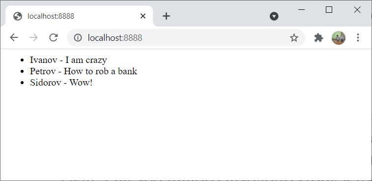
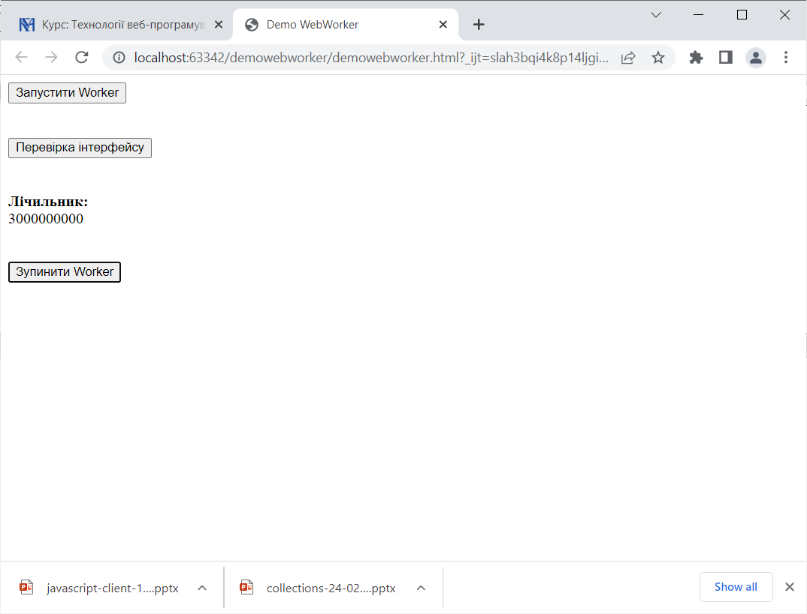
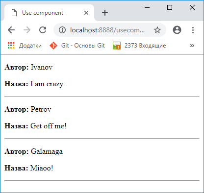
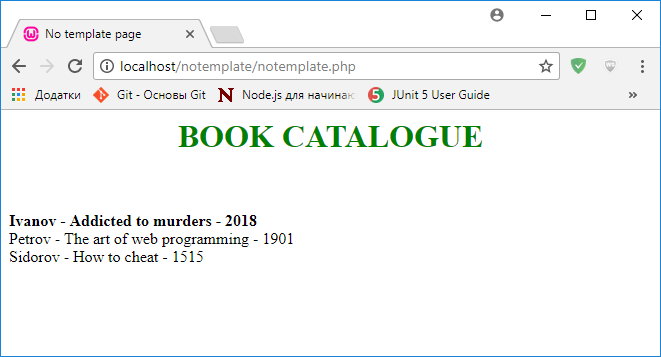

# **ПРОГРАМУВАННЯ ДЛЯ ВЕБ**

## **Збірник завдань**

---

### **Найпростіші консольні застосування**

**Hello, world!** Написати сценарій, який виводить на екран статичний текст ("Hello, world!").

**Максимальний елемент** Написати на Node.js функцію, яка приймає як аргумент масив та повертає максимальний елемент цього масиву. Вправу виконати в двох варіантах:

* У процедурному стилі на основі ітеративного циклу `for`;
* У функціональному стилі з використанням функції `Array.reduce()`.

**Сортування рядків** Написати на Node.js функцію, яка приймає рядок як параметр та повертає рядок, в якому всі символи вхідного рядка відсортовані. Проілюструвати роботу цієї функції.

**Екстремальний інкремент** Знайти мінімальне значення змінної `x`, для якої інструкція:

```javascript
console.log((x++) < x);
```

виводить на екран `false`.

**Нетранзитивні порівняння** Навести приклад таких числових змінних `x, y, z`, що `x == y` дорівнює `true`, `y == z` дорівнює `true`, але `x == z` дорівнює `false`.

**Кращі за посередність** Написати на Node.js функцію, яка приймає як аргумент масив цілих чисел та повертає суму елементів масиву, що перевищують його середнє арифметичне.

**Сортування масивів** Написати на Node.js функцію, яка приймає як аргумент масив цілих чисел та повертає масив, який складається з тих самих чисел, але відсортованих за спаданням значень. Початковий масив при цьому змінитися не повинен.

**Подрахунок символів** Написати на Node.js функцію, яка приймає як аргумент рядок та повертає структуру, яка зберігає інформацію про кількість входжень кожного символа в цей рядок. **Використати асоціативні масиви**.

**Вилучення елемента** Написати на Node.js програму, яка для деякого масиву порівнює час виконання функцій `shift()` та `pop()`. Використати пакет `performance-now`.

---

### **Найпростіші клієнт-серверні застосування**

**Привіт від сервера** Написати простий сервер, який запускається на певному порті та при зверненні до нього передає браузерові статичний текст.

**Відображення сторінки** Написати простий сервер, який запускається на певному порті та при зверненні до нього передає браузерові деяку HTML-сторінку.

**Привітання клієнтові** Написати клієнт-серверне застосування, яке за допомогою форми отримує від клієнта його ім'я та виводить цьому клієнтові привітання.

На основі виконання цієї вправи:

* показати, як можна передати дані до сервера, не використовуючи форму;
* проілюструвати, що може трапитися, якщо користувач введе в полі введення теги розмітки, які не будуть належним чином оброблені.
  *Серверну частину реалізувати на Node.js.*

---

### **Базові формати даних**

**Читання та запис** У текстовому файлі записано кілька слів, розділених пробілами. Написати консольне застосування, яке зчитує файл, виводить його вміст на екран та додає до файлу нове слово.

**Підключення JSON** Дано JSON-файл **messages.json**:

```json
{
  "welcome": "You are welcome",
  "reject": "Go away, please"
}

```

і програму **simplejson.js**:

```javascript
let messages = require("./messages.json");
console.log(messages.welcome);

```

Модифікувати цю програму так, щоб вона виводила всі властивості об'єкта **messages**, отриманого з JSON-файлу.

**JSON-серіалізація** У консольній програмі створити масив об'єктів. Кожний об'єкт описує деяку особистість, зокрема її прізвище та вік. Написати код, який серіалізує цей масив на диску у JSON-форматі, а після цього створює копію масиву шляхом десеріалізації та для цієї копії виводить на екран назви та значення властивості для всіх об'єктів у форматі:

```text
Властивість_1: Значення_1
Властивість_2: Значення_2
--------------------------------------------------
Властивість_1: Значення_1
Властивість_2: Значення_2

```

При цьому ні кількість властивостей для кожного об'єкта, ні назви властивостей заздалегідь невідомі.

**Робот-шпигун** Написати програму, яка зчитує код ресурсу за заданим URL та зберігає його в локальному файлі.

---

### **Шаблонізатори**

**Відображення колекції** В серверній програмі зберігається масив; кожний елемент цього масиву є об'єктом, що описує деяку книжку, зокрема містить дані про автора, назву та рік видання. Забезпечити відображення цієї інформації в браузері з використанням Twig, Pug або іншого шаблонізатору в наступному вигляді:

{width="6.497916666666667in"
height="3.158333333333333in"}
---

### **Бази даних**

**Вибірка з бази** Реорганізувати вправу «Відображення колекції» так, щоб інформація про об'єкти, що мають бути відображені на сторінці, зберігалися в MongoDB.

---

### **Поштова розсилка**

**Поштовий бот** Написати програму, яка надсилає електронного листа за вказаною адресою.

---

### **Колекції**

**Серійні карти** Створити колекцію `Map` з кількома парами ключ-значення. Серіалізувати її в JSON-файл. Далі створити копію колекції шляхом десеріалізації та вивести її вміст на екран.

---

### **Асинхронне програмування**

**Поспішне виведення** Виправити помилку в коді:

```javascript
let fs = require("fs");
let s = undefined;
fs.readFile("test.txt", "utf8", function(error, data) {
    if (error) throw error;
    s = data;
});
console.log(s);

```

**Шлях до асинхронності** Дано код:

```javascript
"use strict";
//Basic function
function foo(x) {
    return x * 2;
}
let r = foo(5);
console.log(r);

```

Реорганізувати цей код так, щоб функція `foo` стала асинхронною (з модифікатором `async`), але так, щоб вираз `x*2` продовжував обчислюватися синхронно. Вправу виконати в двох варіантах:

* без явного використання промісів та `await`;
* з використанням `await`.

**Геть await!** Дано клієнт-серверний застосунок. Сервер на порту 7777:

```javascript
let http = require('http');
let express = require('express');
const PORT = 7777;
let server = express();
server.listen(PORT);
console.log(`Server is running on port ${PORT}`);
server.use(express.static(__dirname));
server.get('/', function(req, res) {
    res.send("Ready to serve");
});

```

Клієнтська програма:

```javascript
"use strict";
const fetch = require('node-fetch');
const url = 'http://127.0.0.1:7777/';
const getData = async url => {
    try {
        const response = await fetch(url);
        let res = await response.text();
        console.log(res);
        return res;
    } catch (error) {
        console.log(error);
    }
};
getData(url);

```

Переробити клієнтський код так, щоб використовувалися не `await`, а `then`.

**Обгортка в проміс** З метою затримки виконання програми на 5 с був написаний код:

```javascript
"use strict";
const waittime = 5000;
setTimeout(() => {
    console.log("Operation finished");
}, waittime);
console.log("Program finished");

```

Переробити програму так, щоб дійсно забезпечувалася затримка виконання всієї програми на 5 с без callback hell. Виконати через:

* проміси;
* `await`.

**Проміс-читач** Написати функцію, яка приймає ім'я файлу та повертає проміс для зчитування (`readFile`). Проміс має використовуватися в явному вигляді (без `async-await`).

**Вторгнення у вічність** Дано код:

```javascript
"use strict";
function doOperation() {
    console.log("I want to be performed!");
}
setTimeout(doOperation, 0);
//Eternal loop
for (let k = 0; ; k++) {
    if (k % 1000000000 == 0) {
        console.log(k);
    }
}

```

Реорганізувати цикл `//Eternal loop` так, щоб він зберіг функціональність, але дозволив виконати callback.

---

### **JavaScript у браузері**

#### **Прості клієнтські сценарії**

**Виведення повідомлення.** Сценарій, який виводить `alert`, а після натискання на Ok показує основний вміст сторінки.

**Діалогове вікно.** Сценарій, який запитує число, поки воно не буде коректним, і виводить його квадрат.

#### **Об'єктна модель документа**

**Додавання вузла.** Написати код, який при натисканні на кнопку **Add** додає до першого елементу `div` новий елемент `p` з текстом "Four".

#### **Комунікації**

**Дані з сервера.** Веб-сторінка, яка за кнопкою отримує дані через `fetch`/`XMLHttpRequest` та оновлює контент.

#### **AJAX**

**Простий AJAX.** Модифікувати клієнтську сторінку та бекенд так, щоб дані оновлювалися автоматично кожну 1 секунду.

#### **Використання WebWorkers**

**Браузерний паралелізм.** Реалізувати запуск та зупинку Web Worker для лічильника.

{width="6.497916666666667in"
height="4.958333333333333in"}
---

### **Фреймворки та бібліотеки**

**Елементарний React**

Написати сторінку, яка забезпечує виведення статичного тексту з
використанням React

**Реактивний об'єкт**

У серверній програмі зберігається об'єкт, який містить дані про деякий
автомобіль (зокрема, про його марку та колір). Написати сторінку, яка
при натисканні на кнопку звертається до сервера, отримує від нього ці
дані в JSON-форматі та забезпечує відображення у вигляді

{width="5.227777777777778in"
height="2.948611111111111in"}

Для відображення використати React.

**Незнайомий об'єкт**

За допомогою React відобразити всі назви і значення властивостей деякого
об'єкта, якщо ці назви та значення заздалегідь невідомі.

Вказівка: скористатися Object.keys() та map()

**Реактивна колекція**

У базі даних зберігається інформація про деякі книжки. Написати
клієнт-серверне застосування зі сторінкою, яка при натисканні на кнопку
забезпечує виведення цієї інформації в наступному вигляді:

{width="4.334722222222222in"
height="4.102083333333334in"}

Використати React. Для відображення окремої книжки створити компонент;
на сторінці використати відповідний елемент Book.

**Використання Vue**

У базі даних зберігається інформація про деякі книжки. Написати
клієнт-серверне застосування зі сторінкою, яка при натисканні на кнопку
забезпечує виведення цієї інформації в наступному вигляді:

{width="4.334722222222222in"
height="4.102083333333334in"}

Використати Vue. Для відображення окремої книжки створити компонент; на
сторінці використати відповідний елемент Book.

---

### **Сценарії на PHP**

* **Привітання клієнтові:** Форма, обробка тегів, передача даних без форми (на PHP).
* **Контроль знань:** Тест з радіокнопками.
* **Хто та звідки:** IP клієнта та `HTTP_REFERER`.
* **Редактор статей:** Список статей з лінками на читання та редагування.
* **Перегляд і виконання:** Сценарій, що показує код або результат роботи іншого файлу.
* **Зворотний порядок:** Реверс слів у файлі.
* **Сортування масивів:** Сортування "Прізвище-Зарплата" через параметри URL.
* **Регулярний калькулятор:** Калькулятор на регулярних виразах без `eval()`.

---

### **Об'єктні риси PHP**

* **Простий клас:** Value Object для запису в блозі.
* **Сутності в Smarty:** Відображення полів класу через Smarty.
* **Універсальний клас:** Динамічні властивості без `__get`/`__set`.
* **Перший крок до DAO:** Методи CRUD для масиву записів.
* **DAO та база даних:** Взаємодія DAO з MySQL.

---

### **Сеанси**

**Лічильник відвідувань.** Виправити проблему лічильника, щоб він не зростав при оновленні сторінки (використати сесії).

```javascript
let express = require('express');
let fs = require("fs");
let server = express();
// ... код сервера ...

```

---

### **Контрольні вправи до самостійної роботи**

**Пошук анаграм.** Пошук груп анаграм у файлі словника (Node.js).
**RESTful-сервіс.** CRUD сервіс для книг на Express + DAO + MongoDB/MySQL.
**Робота з CSV.** Відображення таблиці з CSV з сортуванням через шаблонізатор.
**Пособник спамера.** Розсилка листів з вебінтерфейсом на Bootstrap.
**Товстий клієнт - advanced.** Сервіс на REST та GraphQL з React/Vue та AJAX-оновленням.
**Товстий клієнт.** Реорганізація REST-сервісу для доступу через браузер.

**Крутий сайт.** Створення сайту за макетом:

Створити сайт, кожна сторінка якого побудована на основі наступного
макету:

{width="6.404861111111111in"
height="3.5861111111111112in"}

Відображення реалізувати на основі Twitter Bootstrap та одного з
шаблонізаторів. **Повинні бути реалізовані окремі шаблони для меню та
основного контенту, які підключаються до основного шаблону**. Активний
розділ меню повинен бути відповідним чином виділений.

**Пункти меню реалізувати за допомогою циклу в шаблоні**.

На сторінках ГОЛОВНА та ПРО НАС повинна відображатися деяка статична
інформація (ГОЛОВНА була вище, ПРО НАС може мати вигляд, подібний до
такого):

{width="6.358333333333333in"
height="3.5861111111111112in"}

На сторінці ТРЕНІНГИ повинен відображатися перелік тренінгів, які
зберігаються в базі даних - назва та короткий рекламний слоган:

{width="6.246527777777778in"
height="3.5861111111111112in"}

При натисканні на лінк (або кнопку) Детальніше... повинен відображатися
більш детальний опис обраного тренінгу.

**Виведення тренінгів (як в короткій, так і в повній формі) забезпечити
на основі шаблонізаторів або клієнтських фреймворків Vue чи React (на
вибір).**

Сайт повинен бути двомовним і підтримувати українську та англійську
версії. Відповідно до цього, мають бути версії сторінок різними мовами.

Реєстраційна форма має надавати можливість користувачеві заповнити
заявку. Якщо поля імені або прізвища не заповнені, повинно виводитися
повідомлення "Поле з прізвищем або іменем не повинні бути пустим". Якщо
електронна пошта є некоректною, має виводитися повідомлення "Введена
пошта є некоректною". Якщо номер телефону не відповідає потрібному
формату, має виводитися повідомлення "Неправильний формат телефону". Для
перевірки формату телефону рекомендується використати регулярні вирази.
Якщо пустий текст заявки, має виводитися повідомлення "Текст заявки не
може бути пустим".

**Контроль правильності заповнення форми та виведення повідомлень
повинні здійснюватися засобами клієнтського JavaScript. Якщо форма
заповнена неправильно, дані на сервер відправлятися не повинні!**

Адміністратор повинен мати можливість встановити режим, який вимагає
стандартного підтвердження електронної пошти на основі листа
користувачеві. Цей режим встановлюється в конфігураційному файлі. В
цьому режимі користувачеві має виводитися відповідне повідомлення. В
разі підтвердження користувачеві надсилається лист про прийняття його
заявки.

Якщо ж режим підтвердження не встановлено, повідомлення про успішне
прийняття заявки має виводитися зразу (при цьому сторінка сайту теж має
відображатися).

Заявки мають зберігатися в базі даних (на вибір - MySQL або MongoDB).

Адміністратору має бути наданий окремий інтерфейс для перегляду та
вилучення заявок, а також для додавання нових тренінгів.

Серверну частину реалізувати на основі Node.js та Express.

Назва сайту (в даному прикладі Круті тренінги), його доменне ім'я (в
даному прикладі cooltraining.com.ua), назва файлу з зображенням для
основної сторінки, колір меню, пункти меню та режим підтвердження мають
читатися з конфігураційного файлу (за замовченням config.json).

За бажанням студента та погодженням з викладачем конкретна предметна
область (тренінги) може бути замінена на іншу (книги, товари тощо), але
зі збереженням усіх інших вимог.

---

### **Рефакторинг**

Дано сторінку, яка відображає деякий книжковий каталог; для кожної книги
відображається її автор, назва та рік видання. При цьому книжки, видані
після 2010 року, повинні відображатися жирним шрифтом. Використовується
PHP:

```php
<html>
<body bgcolor="white">
<center><font color="green"><h1>BOOK CATALOGUE</h1></font></center>
<?php 
// ... старий код ...
?>
</body>
</html>

```
Цей код відображається наступним чином:

{width="6.502083333333333in"
height="3.5118055555555556in"}

Завдання:
Показати недоліки наведеного рішення. Реорганізувати його в наступних
напрямках:

- уникати deprecated-тегів (зокрема, \<font\>); оформлення сторінки
здійснювати на основі таблиць стилів;

- повністю відокремити рівень представлення від бізнес-логіки --
зокрема, на сторінці, яка призначена для відображення, не повинно бути
PHP-коду; для такого відокремлення використати Smarty або Twig;

- дані про книжки зберігати в базі даних MySQL в таблиці books;

- відокремити бізнес-логіку від рівня даних на основі DAO та VO; всі
звернення до даних повинні здійснюватися лише через DAO; повинна
здійснюватися нелінива ініціалізація DAO, тобто при кожному зверненні
всі дані з бази даних повинні завантажуватися в DAO; в класі DAO мають
бути функції ініціалізації даних та отримання всіх книжок.

**Бонус** Реалізувати варіант цієї вправи на Laravel.

